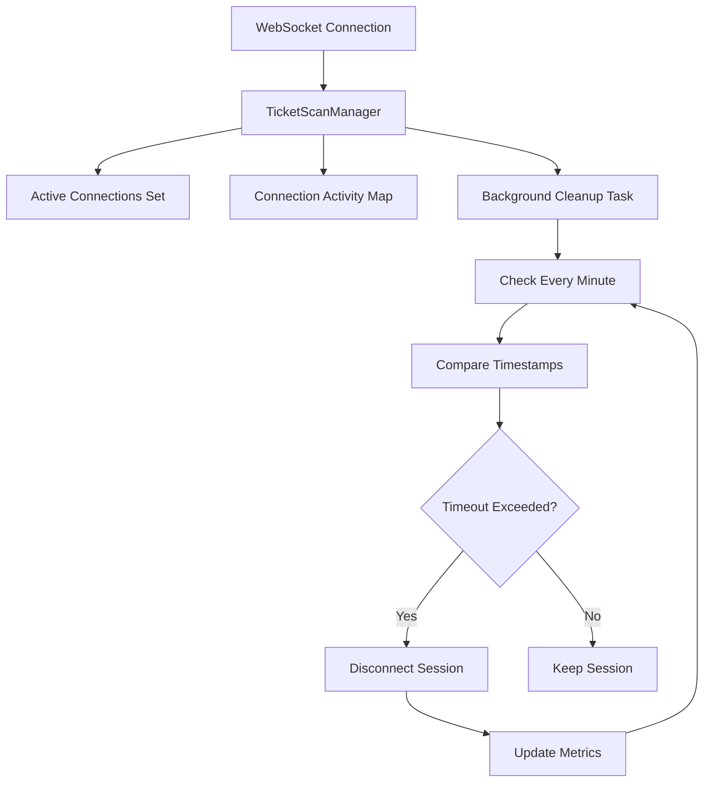

# WebSocket Session Timeout Feature

## Overview

This feature implements automatic expiration of inactive WebSocket sessions to prevent resource leaks and maintain system performance. Sessions that remain inactive for a configurable period will be automatically cleaned up.

## Configuration

### Environment Variables

Add the following to your `.env` file:

```env
# WebSocket Session Configuration
SESSION_TIMEOUT_MINUTES=30
```

**Default**: 30 minutes

**Valid Values**: Any positive integer representing minutes

### Example Configurations

```env
# Short timeout for development/testing
SESSION_TIMEOUT_MINUTES=5

# Longer timeout for production
SESSION_TIMEOUT_MINUTES=60

# Very long timeout (2 hours)
SESSION_TIMEOUT_MINUTES=120
```

## How It Works

### Session Tracking

1. **Connection Establishment**: When a client connects via WebSocket, the system:
   - Adds the connection to the active connections set
   - Records the current timestamp as the last activity time

2. **Activity Updates**: Activity timestamps are updated when:
   - A new connection is established
   - A broadcast message is sent to all clients
   - Any WebSocket communication occurs

3. **Background Cleanup**: A background task runs every minute to:
   - Check all active connections
   - Compare last activity time with current time
   - Disconnect sessions that exceed the timeout threshold
   - Log cleanup statistics

### Architecture



## API Changes

### New Methods in TicketScanManager

```python
class TicketScanManager:
    def __init__(self, session_timeout_minutes: int = 30):
        """Initialize manager with configurable timeout."""
        pass
    
    async def start_cleanup_task(self):
        """Start the background cleanup task."""
        pass
    
    async def stop_cleanup_task(self):
        """Stop the background cleanup task."""
        pass
```

## Logging

The system provides detailed logging for session management:

```
INFO:ticket_scans.manager:WebSocket connected. total connections=1
INFO:ticket_scans.manager:Started session cleanup task with 30.0 minute timeout
INFO:ticket_scans.manager:Cleaned up 2 inactive session(s)
INFO:ticket_scans.manager:WebSocket disconnected. total connections=0
INFO:ticket_scans.manager:Stopped session cleanup task
```

## Testing

### Running Tests

```bash
# Run session timeout tests
python -m pytest tests/test_session_timeout.py -v

# Run all tests including session timeout
python -m pytest --cov=src --cov-report=term-missing
```

### Test Coverage

The test suite includes:
- ✅ Manager initialization with timeout configuration
- ✅ Connection activity tracking
- ✅ Session cleanup logic
- ✅ Background task lifecycle
- ✅ Broadcast activity updates
- ✅ Environment variable configuration
- ✅ Exception handling in cleanup
- ✅ Multiple broadcast scenarios

## Performance Considerations

### Memory Usage
- Each connection stores one datetime object (~8 bytes)
- For 1000 concurrent connections: ~8KB additional memory
- Activity map is cleaned up automatically during timeout processing

### CPU Usage
- Background task runs every 60 seconds
- Time comparison is O(1) per connection
- Minimal impact on system performance

### Network Impact
- No additional network traffic
- Natural disconnection when timeout occurs
- Clients can reconnect automatically if needed

## Error Handling

The system gracefully handles:
- Connection failures during broadcast
- Exceptions in cleanup task
- Invalid datetime operations
- Race conditions during concurrent access

## Monitoring

### Key Metrics to Monitor
- Active connection count
- Cleanup frequency
- Average session duration
- Cleanup task health

### Example Monitoring Setup
```python
# Log metrics periodically
logger.info(f"Active connections: {len(manager.active_connections)}")
logger.info(f"Tracked activities: {len(manager.connection_activity)}")
```

## Troubleshooting

### Common Issues

1. **Sessions not expiring**
   - Check `SESSION_TIMEOUT_MINUTES` value
   - Verify cleanup task is running
   - Review logs for errors

2. **Premature disconnections**
   - Increase timeout value
   - Check for network issues
   - Verify client heartbeat mechanism

3. **High memory usage**
   - Monitor connection count
   - Check for connection leaks
   - Review cleanup task performance

### Debugging Steps

```bash
# Check current environment
echo $SESSION_TIMEOUT_MINUTES

# Monitor logs in real-time
tail -f logs/app.log | grep "session"

# Check active connections
# (Add endpoint to expose connection count)
```

## Best Practices

1. **Timeout Values**
   - Development: 5-10 minutes
   - Production: 30-60 minutes
   - High-traffic: Consider shorter timeouts

2. **Client Implementation**
   - Implement automatic reconnection
   - Add heartbeat mechanism
   - Handle disconnect gracefully

3. **Monitoring**
   - Set up alerts for high connection counts
   - Monitor cleanup task health
   - Track session duration metrics

## Future Enhancements

Possible improvements:
- Per-client timeout configuration
- Activity-based timeout (message frequency)
- Session persistence across restarts
- Graceful disconnect notifications
- Custom timeout policies